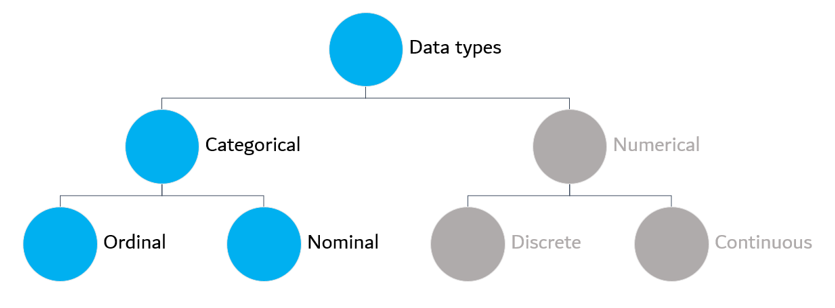
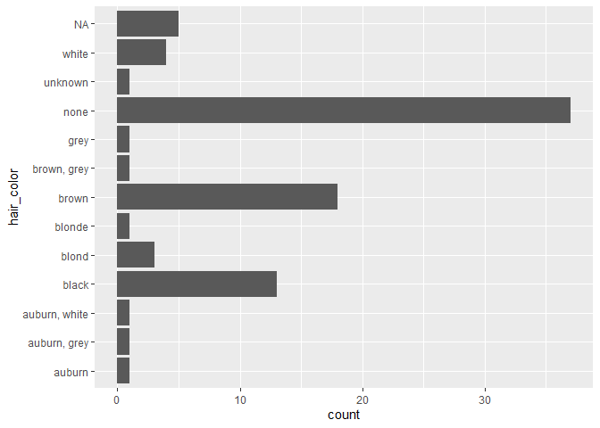
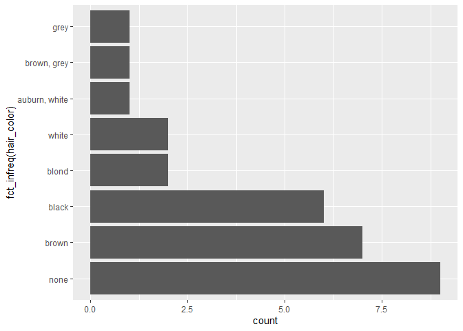
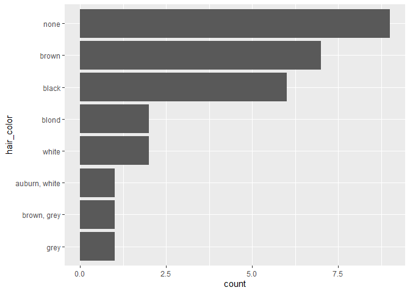
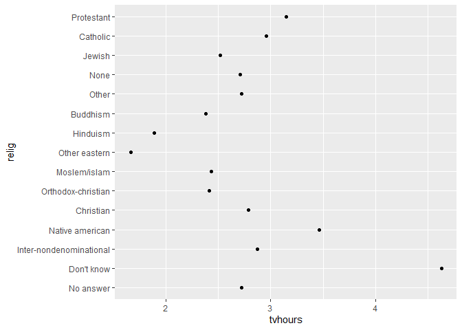
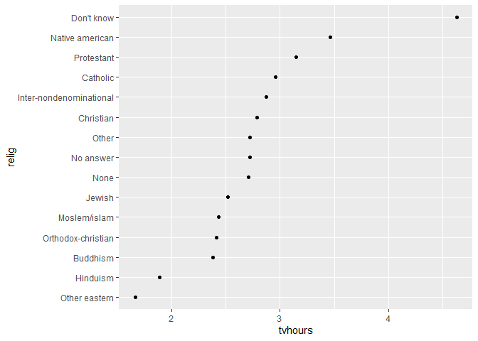
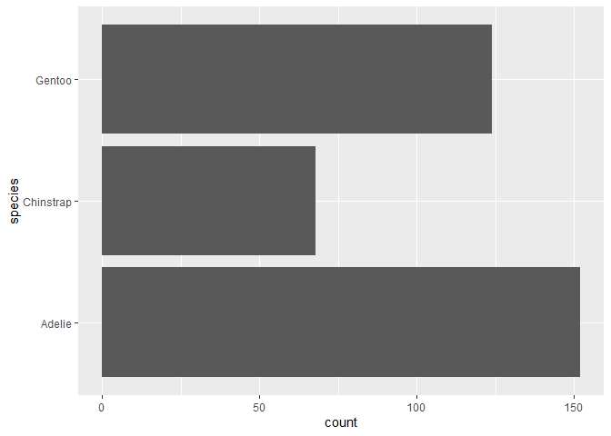
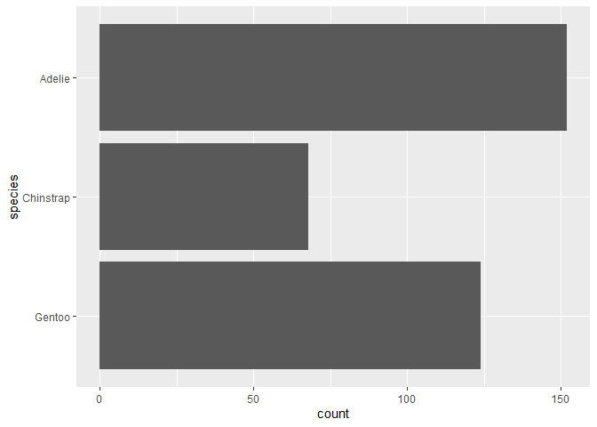

  
<style>
div.answer {background-color:#f3f0ff; border-radius: 5px; padding: 20px;}
</style>


<!-- Do not forget to input your Github username in the YAML configuration up there --> 

***
# Outline

1. Recall: Categorical data as factors
2. Functions: 

* `fct_inorder()`
* `fct_infreq()`
* `fct_rev()`
* `fct_reorder()`
* `fct_relevel()`
* `fct_lump()`
* `fct_recode()` 
* `fct_collapse()`
3. Exercises

# Categorical data as factors

Let's remember that 📖, unlike a numerical variable, a categorical one has a limited measurement scale or possible values, i.e. categories or levels in R.



Categorical variables might take two types ✌️ of scales:

- Nominal: when the categories do not have an order: marital status, gender, religion affiliation, migrant status, blood type.

- Ordinal: when the categories have an order: social class, risk rating, object condition (good, regular, bad).

Categorical variables are coded as factors in R 😮. Why 🙋? Among other reasons, because factors are much easier to work with than characters 😅.

But treating this data as factors could lead to processing the data in an inappropriate way 😧. As many of the functions automatically get converted from characters to factors, then factors often are presented in a non-helpful manner 😕.

Fortunately, tidyverse through **forcats** 😼 is here to provide tools for dealing with categorical variables and to help us💪! 


```r
library(dplyr)
library(ggplot2)
library(forcats)
library(palmerpenguins)
library(jsonlite)
```

## Creating factors

Let's say we have a variable that records age status:


```r
x1 <- c("senior", "baby", "adult")
```

If we record this variable as a string, it could not be display in a useful way.


```r
sort(x1)
```

```
[1] "adult"  "baby"   "senior"
```
To avoid this, we can create a factor, starting by listing all the valid levels:


```r
age_levels <- c("baby", "child", "teenager", "adult", "middle_age", "senior")
```

With the list of all valid levels, we can create a factor with the `factor()`function:


```r
y1 <- factor(x1, levels = age_levels)
y1
```

```
[1] senior baby   adult 
Levels: baby child teenager adult middle_age senior
```
If we omit the levels, they will be taken from the data and displayed in a alphabetical order:


```r
factor(x1)
```

```
[1] senior baby   adult 
Levels: adult baby senior
```

# Forcats 😼 functions 

## Ordering the levels


If it is our preference to keep the order of the levels of the first appearance in the data, we can use the `fct_inorder`function:


```r
age <- x1 %>% factor() %>% fct_inorder()
age
```

```
[1] senior baby   adult 
Levels: senior baby adult
```


## Ordering by frequency


For better visualization, it is often useful to change the order of the factor levels. Let's use the *starwars* data set to explain. We can plot a bar graph to visualize the most common hair color among the star wars characters:


```r
ggplot(starwars, aes(x = hair_color)) + 
    geom_bar() + 
    coord_flip() 
```

<!-- -->


As we can see, this is a case of an unordered categorical variable. For better visualization, we can reorder it by the frequency of haircolor.

For that, we can use the function `fct_infreq()`:


```r
ggplot(na.omit(starwars), aes(x = fct_infreq(hair_color))) + 
  geom_bar() + 
  coord_flip()
```

<!-- -->

We can notice that NA by default is placed at the top. Also, we can see that it is automatically ordered in a decreasing way.


## Reversing


For an ascendant order, we should reverse the order that was automatically displayed in a  descendant one. It is done by using the `fct_rev()`function:


```r
na.omit(starwars) %>%
  mutate(hair_color = hair_color %>% fct_infreq() %>% fct_rev()) %>%
  ggplot(aes(y = hair_color)) +
    geom_bar()
```

<!-- -->

## Ordering by another variable


Let's take the *gss_cat* data set, from the `forcats` package, to illustrate. Imagine we want to visualize how many hours in average a person spends watching tv per day. We want to display this statistic by the religion the person professes.

We can do that by plotting a geom_point() graphic:


```r
relig <- gss_cat %>%
  group_by(relig) %>%
  summarise(
    age = mean(age, na.rm = TRUE),
    tvhours = mean(tvhours, na.rm = TRUE),
    n = n()
  )

ggplot(relig, aes(tvhours, relig)) + geom_point()
```

<!-- -->

As we can see, the code gives back a disordered plot that makes it harder to visualize and analyse information. Without an overall pattern, it gets difficult to interpret the plot. 

In this case, we want to order by religion. We can do this using the `fct_reorder()` function, which reorders one variable ("relig") by another ("tvhours").


```r
relig %>%
  mutate(relig = fct_reorder(relig, tvhours)) %>%
  ggplot(aes(tvhours, relig)) +
    geom_point()
```

<!-- -->

Now it is easy to point out which members of a certain religion watch more/less tv and compare among these religions.

## Manually reordering


Let's use now the *palmerpenguins* dataset 🐧. This contains size measurements for three penguin species observed on three islands in the Palmer Archipelago, Antarctica. 

You may check the levels of the categorical variable "species" with the function `levels()`, which prints them in order:
  

```r
levels(penguins$species)
```

```
[1] "Adelie"    "Chinstrap" "Gentoo"   
```

How is the distribution of the species? 
  

```r
penguins %>%
  count(species)
```

<div data-pagedtable="false">
  <script data-pagedtable-source type="application/json">
{"columns":[{"label":["species"],"name":[1],"type":["fct"],"align":["left"]},{"label":["n"],"name":[2],"type":["int"],"align":["right"]}],"data":[{"1":"Adelie","2":"152"},{"1":"Chinstrap","2":"68"},{"1":"Gentoo","2":"124"}],"options":{"columns":{"min":{},"max":[10]},"rows":{"min":[10],"max":[10]},"pages":{}}}
  </script>
</div>

```r
  ggplot(penguins,aes(y = species)) +
  geom_bar() 
```

<!-- -->

Notice that the species categories and the island are in alphabetical order. This is the same order if you would plot it. If the data were ordinal️, highly probable the categories would be ordered by the level assigned to all possible categories, even with the "non-answer" in the top 😰. 

To tailor the data order as we need for our analytic purposes, we might call the function `fct_relevel()` to manually reorder the levels of the factor. 
As second argument, you should make it explicit where you want the categories. 


```r
penguins %>%
  mutate(species = fct_relevel(species, "Gentoo", "Chinstrap", "Adelie")) %>%
  ggplot(aes(y = species)) +
  geom_bar()
```

<!-- -->

Even more, by default R moves the categories to the front, but if you want to change this movement, you can point out that you want to place the level after another with `after`. 


```r
fct_relevel(penguins$species, c("Adelie"), after = 0) %>%
  levels()
```

```
[1] "Adelie"    "Chinstrap" "Gentoo"   
```
  

```r
fct_relevel(penguins$species, c("Adelie"), after = 1) %>%
  levels()
```

```
[1] "Chinstrap" "Adelie"    "Gentoo"   
```

```r
fct_relevel(penguins$species, c("Adelie"), after = 2) %>%
  levels()
```

```
[1] "Chinstrap" "Gentoo"    "Adelie"   
```

Say you want to move the level to the end, then you indicate `after` equal to `Inf`. 


```r
 fct_relevel(penguins$species, c("Adelie"), after = Inf) %>%
  levels()
```

```
[1] "Chinstrap" "Gentoo"    "Adelie"   
```


## Combining levels


Let's have a look at skin color of the star wars' characters: 


```r
starwars %>%
  count(skin_color, sort = TRUE)
```

<div data-pagedtable="false">
  <script data-pagedtable-source type="application/json">
{"columns":[{"label":["skin_color"],"name":[1],"type":["chr"],"align":["left"]},{"label":["n"],"name":[2],"type":["int"],"align":["right"]}],"data":[{"1":"fair","2":"17"},{"1":"light","2":"11"},{"1":"dark","2":"6"},{"1":"green","2":"6"},{"1":"grey","2":"6"},{"1":"pale","2":"5"},{"1":"brown","2":"4"},{"1":"blue","2":"2"},{"1":"blue, grey","2":"2"},{"1":"orange","2":"2"},{"1":"tan","2":"2"},{"1":"unknown","2":"2"},{"1":"white","2":"2"},{"1":"white, blue","2":"2"},{"1":"yellow","2":"2"},{"1":"brown mottle","2":"1"},{"1":"brown, white","2":"1"},{"1":"fair, green, yellow","2":"1"},{"1":"gold","2":"1"},{"1":"green-tan, brown","2":"1"},{"1":"green, grey","2":"1"},{"1":"grey, blue","2":"1"},{"1":"grey, green, yellow","2":"1"},{"1":"grey, red","2":"1"},{"1":"metal","2":"1"},{"1":"mottled green","2":"1"},{"1":"none","2":"1"},{"1":"red","2":"1"},{"1":"red, blue, white","2":"1"},{"1":"silver, red","2":"1"},{"1":"white, red","2":"1"}],"options":{"columns":{"min":{},"max":[10]},"rows":{"min":[10],"max":[10]},"pages":{}}}
  </script>
</div>

Star wars characters have 31 skin colors. Who can analyse/memorise/report the frequency of such a wide variety of skin colors? Even if we were to graph this frequency, the graph would be very long. So, let's simplify!  Let's just choose the 5 most frequent skin color of these characters and let's group the remaining in one category, which we are going to call it as everybody else calls it: "other".

So, we might do this exploting the function `fct_lump()` to "lump" all the least frequent skin colors. The number of levels to keep is `n`.


```r
starwars %>%
  mutate(skin_color = fct_lump(skin_color, n = 5)) %>%
  count(skin_color, sort = TRUE)
```

<div data-pagedtable="false">
  <script data-pagedtable-source type="application/json">
{"columns":[{"label":["skin_color"],"name":[1],"type":["fct"],"align":["left"]},{"label":["n"],"name":[2],"type":["int"],"align":["right"]}],"data":[{"1":"Other","2":"41"},{"1":"fair","2":"17"},{"1":"light","2":"11"},{"1":"dark","2":"6"},{"1":"green","2":"6"},{"1":"grey","2":"6"}],"options":{"columns":{"min":{},"max":[10]},"rows":{"min":[10],"max":[10]},"pages":{}}}
  </script>
</div>


We can also use another grouping criterion. Let's use a frequency ratio: let's only keep skin colours that have at least 10% of the characters. For this we will group using `prop`: 
  

```r
starwars %>%
  mutate(skin_color = fct_lump(skin_color, prop = .1)) %>%
  count(skin_color, sort = TRUE)
```

<div data-pagedtable="false">
  <script data-pagedtable-source type="application/json">
{"columns":[{"label":["skin_color"],"name":[1],"type":["fct"],"align":["left"]},{"label":["n"],"name":[2],"type":["int"],"align":["right"]}],"data":[{"1":"Other","2":"59"},{"1":"fair","2":"17"},{"1":"light","2":"11"}],"options":{"columns":{"min":{},"max":[10]},"rows":{"min":[10],"max":[10]},"pages":{}}}
  </script>
</div>

Only light and fair skin colour met the criterion of a frequency greater than 10%, so the remainder was grouped under "other".

Do you want to rename "extra" instead of "other"? No problem: the argument `other_level` changes it:
  

```r
starwars %>%
  mutate(skin_color = fct_lump(skin_color, prop = .1, other_level = "extra")) %>%
  count(skin_color, sort = TRUE)
```

<div data-pagedtable="false">
  <script data-pagedtable-source type="application/json">
{"columns":[{"label":["skin_color"],"name":[1],"type":["fct"],"align":["left"]},{"label":["n"],"name":[2],"type":["int"],"align":["right"]}],"data":[{"1":"extra","2":"59"},{"1":"fair","2":"17"},{"1":"light","2":"11"}],"options":{"columns":{"min":{},"max":[10]},"rows":{"min":[10],"max":[10]},"pages":{}}}
  </script>
</div>

Let's do something with a continuous variable of this base: height. Now, we want to group it by the most frequent skin categories. Let's ask what is the average height of the characters by skin colour? Let's just check the 5 most popular skin colours and eliminate the `NA`.  


```r
avg_height_by_skin_color <- starwars %>%
  mutate(skin_color = fct_lump(skin_color, n = 5)) %>%
  group_by(skin_color) %>%
  summarise(mean_height = mean(height, na.rm = TRUE))
avg_height_by_skin_color
```

<div data-pagedtable="false">
  <script data-pagedtable-source type="application/json">
{"columns":[{"label":["skin_color"],"name":[1],"type":["fct"],"align":["left"]},{"label":["mean_height"],"name":[2],"type":["dbl"],"align":["right"]}],"data":[{"1":"dark","2":"183.4000"},{"1":"fair","2":"177.3125"},{"1":"green","2":"169.0000"},{"1":"grey","2":"203.8333"},{"1":"light","2":"169.5556"},{"1":"Other","2":"169.3846"}],"options":{"columns":{"min":{},"max":[10]},"rows":{"min":[10],"max":[10]},"pages":{}}}
  </script>
</div>


## Modifying factor levels


The forcats package is not only used to change the order of the levels at our will. It is also used to change the order assigned of the levels in the R code, i.e. to recode the levels of the categories. To do this we need the function `fct_recode()`. This makes less temporary but more permanent changes to the R code because it adjusts the labels for publication and collapses the levels for making easy our analysis.

Let's look at the political spectrum of the *gss_cat* survey:
  

```r
gss_cat %>% count(partyid)
```

<div data-pagedtable="false">
  <script data-pagedtable-source type="application/json">
{"columns":[{"label":["partyid"],"name":[1],"type":["fct"],"align":["left"]},{"label":["n"],"name":[2],"type":["int"],"align":["right"]}],"data":[{"1":"No answer","2":"154"},{"1":"Don't know","2":"1"},{"1":"Other party","2":"393"},{"1":"Strong republican","2":"2314"},{"1":"Not str republican","2":"3032"},{"1":"Ind,near rep","2":"1791"},{"1":"Independent","2":"4119"},{"1":"Ind,near dem","2":"2499"},{"1":"Not str democrat","2":"3690"},{"1":"Strong democrat","2":"3490"}],"options":{"columns":{"min":{},"max":[10]},"rows":{"min":[10],"max":[10]},"pages":{}}}
  </script>
</div>

Labels are meaningless, aren't they? They are inconsistent. Let's make our analysis more understandable: Let's tweak the labels, no matter if they are longer, but better presented.


```r
gss_cat %>%
  mutate(partyid = fct_recode(partyid,
    "Republican, strong"    = "Strong republican",
    "Republican, weak"      = "Not str republican",
    "Independent, near rep" = "Ind,near rep",
    "Independent, near dem" = "Ind,near dem",
    "Democrat, weak"        = "Not str democrat",
    "Democrat, strong"      = "Strong democrat"
  )) %>%
  count(partyid)
```

<div data-pagedtable="false">
  <script data-pagedtable-source type="application/json">
{"columns":[{"label":["partyid"],"name":[1],"type":["fct"],"align":["left"]},{"label":["n"],"name":[2],"type":["int"],"align":["right"]}],"data":[{"1":"No answer","2":"154"},{"1":"Don't know","2":"1"},{"1":"Other party","2":"393"},{"1":"Republican, strong","2":"2314"},{"1":"Republican, weak","2":"3032"},{"1":"Independent, near rep","2":"1791"},{"1":"Independent","2":"4119"},{"1":"Independent, near dem","2":"2499"},{"1":"Democrat, weak","2":"3690"},{"1":"Democrat, strong","2":"3490"}],"options":{"columns":{"min":{},"max":[10]},"rows":{"min":[10],"max":[10]},"pages":{}}}
  </script>
</div>
We can even combine categories into a single new category if this makes sense to us with the function `fct_collapse`:


```r
gss_cat %>%
  mutate(partyid = fct_collapse(partyid,
    other = c("No answer", "Don't know", "Other party"),
    rep = c("Strong republican", "Not str republican"),
    ind = c("Ind,near rep", "Independent", "Ind,near dem"),
    dem = c("Not str democrat", "Strong democrat")
  )) %>%
  count(partyid)
```

<div data-pagedtable="false">
  <script data-pagedtable-source type="application/json">
{"columns":[{"label":["partyid"],"name":[1],"type":["fct"],"align":["left"]},{"label":["n"],"name":[2],"type":["int"],"align":["right"]}],"data":[{"1":"other","2":"548"},{"1":"rep","2":"5346"},{"1":"ind","2":"8409"},{"1":"dem","2":"7180"}],"options":{"columns":{"min":{},"max":[10]},"rows":{"min":[10],"max":[10]},"pages":{}}}
  </script>
</div>

# Wrapping up

We might sum up the functions as:

* `fct_inorder()` : Organizing the order in which they first appear.
* `fct_infreq()`  : Reordering a factor by the frequency of values.
* `fct_rev()`     : Reversing any criteria of ordering.
* `fct_reorder()` : Reordering a factor by another variable.
* `fct_relevel()` : Changing the order of a factor by hand.
* `fct_lump()`    : Grouping the least/most frequent values of a factor into “other”.
* `fct_recode()`  : Clarifying labels of levels.
* `fct_collapse()`: Collapsing a lot of old levels into a new variable.


# References

Pandas. (2022, November 11). Categorical data. Retrieved from pandas: https://pandas.pydata.org/docs/user_guide/categorical.html

R for Data Science. (2022, November 12). R for Data Science. Retrieved from R for Data Science: https://r4ds.had.co.nz/factors.html#factors

ScienceDirect. (2022, November 12). Categorical Variable. Retrieved from ScienceDirect: https://www.sciencedirect.com/topics/mathematics/categorical-variable

Wilke, C. (2022, November 12). The Wilke Lab - The University of Texas at Austin. Retrieved from Getting things into the right order: https://wilkelab.org/SDS375/slides/getting-things-in-order.html#16
